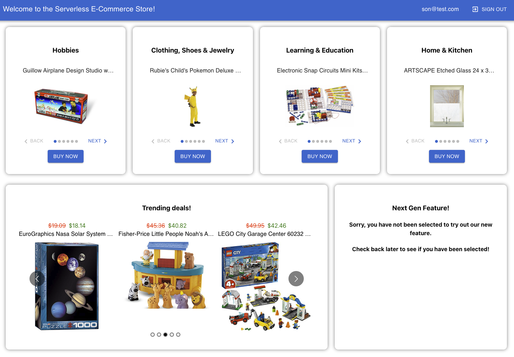

# Node Rules Engine, Feature Flags, and Dynamic Configuration for Node.JS applications and AWS Lambda

This is a repo that demonstrates the Lambda Genie features. It contains a UI project (simple CRA based app with AWS Amplify Components integrated with AWS Cognito and AWS API Gateway) and an API project (cdk project AWS API Gateway with AWS Lambda REST Api Integration and Cognito Authorizer). The lambda function uses the app genie features to dynamically build a response for the UI to render a personalized dashboard.

In this repo, we will be building an online e-commerce store. There will be 2 rows where we will showcase products. In the first row, we will have 4 slots, where business users can choose the categories of products that they want to showcase. The second slot will have further customizations where we will show targeted products based on age and gender of the logged in user.

The second row will have 2 slots, a carousel of curated products that are on sale, where the business users can choose the products that they want to showcase and the discount that they want to offer. The second slot will have a placeholder for a feature flag protected feature. This feature will be enabled for a select group of users.

The final product will look like this:



## Getting Started

### Prerequisites
Please make sure you have the following installed on your machine:
- Node.js
- AWS CLI
- AWS CDK
- An account with Lambda Genie (https://lambdagenie.com) where you have configured your rules, feature flags, and dynamic configuration
and published your config to a bucket you specify in the cdk project (api/lambda/utils/config-utils.ts) 
- If you do not have an account with Lambda Genie, you can use the sample config.json file in the cdk project (api/config.json) to test the app.
Just make sure you update the bucket name in the cdk project (api/lambda/utils/config-utils.ts) to point to the bucket where you uploaded the config.json file.
- This project also demonstrates runtime configuration of AWS Lambda from values stored in AWS Secrets Manager, AWS Systems Manager Parameter Store, AWS S3, and AWS DynamoDB.


```ts
const bucketParams = {
    Bucket: "lambda-genie-rules",
    Key: "config.json",
};
```

### Installation
1. Clone the repo
2. Install the dependencies for the UI project
```
cd ui
npm install
```
3. Install the dependencies for the API project
```
cd api
npm install
```

### Deployment
1. Deploy the API project
```
cd api
npm run watch
```
2. Gather output values from the API project
Once the API project is deployed, you will need to gather the following from the output:
- DemoStack.ProductsApiUrl
- DemoStack.UserPoolId
- DemoStack.UserPoolClientId

3. Configure awsExports.js in the UI project
Once the API project is deployed, you will need to configure the UI project to use the API.
In the UI project, open the file `src/aws-exports.js` and update the following values:
- `userPoolId` - Replace the value with the Cognito User Pool ID from the API project output from step 2
- `userPoolWebClientId` - Replace the value with the Cognito User Pool Client ID from the API project output from step 2

4. Create a proxy configuration file
In the UI project, create a file called `src/setupProxy.js` and add the following content:
```js
    const { createProxyMiddleware } = require('http-proxy-middleware');

    module.exports = function(app) {
    app.use(
        '/api',
        createProxyMiddleware({
        target: 'https://<API Gateway ID>.execute-api.<AWS Region>.amazonaws.com/<Stage Name>',
        changeOrigin: true,
        secure: false,
            pathRewrite: {
                '^/api': ''
            }
        })
    );
    };
```
Replace the target value with the API Gateway URL from the API project output from step 2

4. Deploy the UI project
```
cd ui
npm start
```


## What is Lambda Genie?

Lambda Genie is a tool provides a simple, yet powerful platform to define business rules, intelligent 
feature flags, and manage dynamic configuration values. It is a cloud-native, serverless solution that
can be deployed in minutes and scales to meet the needs of any organization. Although designed
to work with AWS Lambda, it can be used with any platform that runs Node.js.


### Rules Engine

The Rules Engine is a powerful tool that allows you to define business rules and execute them in real-time.
It has 0 dependencies and can be added to any Node.js project. Augmented by the Lambda Genie Console, 
you can easily define your business entities and empower your stakeholders to manage the rules that 
operate on them.

### Feature Flags

Feature flags are a powerful tool that allow you to control the release of new features to your users.
Integrated with the Rules Engine, you can define complex rules that control who sees the feature and 
when. Feature flags can be as simple as a boolean value or as complex as a complex rule that evaluates
the user's location, device type, and other attributes to determine if the feature should be enabled.

### Dynamic Configuration
Dynamic configuration allows you to manage configuration values that are used by your application.
You can define configuration schemas and allow your stakeholders to manage the values. This ensures
integrity of the values while allowing your stakeholders to manage them without having to redeploy.
The configuration module supports multiple configuration stores, categorized into customized sources, that 
are static values that are defined in the configuration schema, and AWS specific sources. 

#### Custom Dynamic Configuration
The configuration module allows you to define configuration schemas, which are JSON schemas that define
the structure of the configuration objects, validation rules, and default values. Built on top of 
industry standard JSON schemas, this powerful feature allows you to define complex configuration objects
that can be managed by your stakeholders, while ensuring the integrity of the values.

#### AWS Dynamic Configuration
The configuration module also supports AWS specific configuration sources.
We have built in configuration sources for AWS Secrets Manager, AWS Systems Manager Parameter Store,
and AWS S3, AWS DynamoDB, and HTTP/API endpoints. 


### Environment Management
The Environment Management module allows you to define environments and manage the configuration values
for each environment. You can define environments for your application, such as development, staging,
and production, and manage the configuration values for each environment. This allows you to have custom 
configuration values, feature flags, and business rules for each environment.

